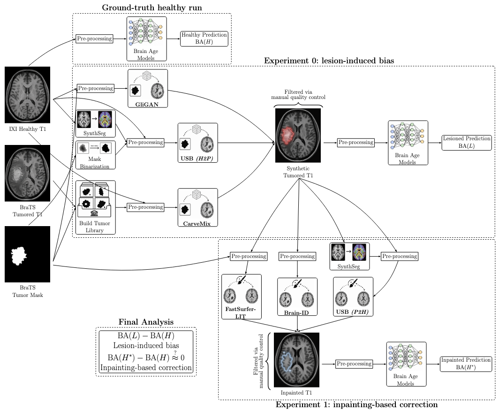

# brainage (public LESION AGNOSTICISM sub-repo)

<p align="center">
  
</p>

Research codebase for **brain age prediction under synthetic and real lesions**, comparing lesion-agnostic modelling strategies. The main brainage repository is split into two main tracks:

| Track | Purpose |
|-------|---------|
| [`lesion_agnostic/`](lesion_agnostic/) | Thesis pipeline: synthetic lesion generation (Exp 0), inpainting (Exp 1), preprocessing, brain-age inference, and statistical post-processing | Author: Kayra Özdemir |
| [`modality_agnostic/`](modality_agnostic/) | Earlier brain-age training framework (T1, segmentation maps, multitask models) used for model development and ablations of JOOS. Only relevant scripts are extracted from this folder, and the rest of the files are KEPT PRIVATE. | Author: Andras Joós |

Most MRI volumes, checkpoints, and experiment outputs are **not stored in git** (see [External data & private files](#external-data--private-files)).

---

## Naming conventions

These abbreviations appear throughout configs, prediction CSVs, and analysis scripts.

| Code | Meaning |
|------|---------|
| **BNX** | BrainAgeNeXt brain-age model |
| **JOOS** | Andras multi-task brain-age model (`exp_0/models/Andras`) |
| **CM** | CarveMix synthetic lesion generator |
| **GLI** | GliGAN synthetic lesion generator |
| **USB** | Unified Synthetic Brain (synthetic lesion generator AND inpainting) |
| **LIT** | neuroLIT lesion inpainting |
| **BID** | Brain-ID lesion inpainting |

**Experiment levels**

- **Exp 0** — healthy IXI brain + synthetic lesion pasted in → brain age on lesioned image (no inpainting).
- **Exp 1** — same synthetic lesion → inpaint/remove lesion → brain age on restored image.

Prediction CSV naming (used by post-processing):

```
healthy/   JOOS_IXI.csv, BNX_IXI.csv
exp0/      BNX_IXI_CM.csv, JOOS_IXI_GLI.csv, …
exp1/      BNX_CM_LIT.csv, JOOS_GLI_BID.csv, …
```

---

## Repository layout

```
brainage/
├── lesion_agnostic/          # Main lesion-agnostic experiment pipeline
│   ├── configs/              # SLURM launcher configs
│   ├── data/                 # Labels, predictions, results, MNI152 template
│   ├── exp_0/                # Synthetic lesion generators + brain-age inference + processing
│   └── exp_1/                # Inpainting methods
└── modality_agnostic/        # JOOS' training folder
```

### `lesion_agnostic/configs/`

Ready-to-edit job scripts for the HPC cluster. Paths inside often point to cluster home directories.

| Folder | Runs |
|--------|------|
| `CM/` | CarveMix generation and pairing |
| `GLI/` | GliGAN N4/rigid prep |
| `USB/` | USB dataset creation, p2h/h2p editing, affine/mask utilities |
| `BID/` | Brain-ID batch reconstruction |
| `LIT/` | neuroLIT batch inpainting |
| `UNA/` | UNA demos |
| `JOOS_PREP/` | Preprocessing for the Andras (JOOS) model |
| `BNX_PREP/` | Preprocessing for BrainAgeNeXt |
| `synthseg/` | SynthSeg segmentation jobs |
| `misc/` | SynthStrip, SynthSR, alignment utilities |

### `lesion_agnostic/data/`

| Subfolder | Contents |
|-----------|----------|
| `labels/` | Demographics / pairing spreadsheets (`IXI_clean.xls`, BraTS labels, …) |
| `predictions/` | Brain-age CSV outputs per model (`BrainAgeNeXt/`, `Andras/`, `SFCN/`, …) |
| `results/` | Aggregated plots and post-processed statistics |
| `MNI152_T1_1mm_Brain.nii` | MNI template used by preprocessing (tracked in git) |

Expected but **gitignored** sibling paths (created during experiments):

```
lesion_agnostic/data/raw/              # Raw IXI / BraTS downloads
lesion_agnostic/data/preprocessed/     # Model-specific preprocessed MRI
lesion_agnostic/data/library/          # CarveMix BraTS mask library
```

### `lesion_agnostic/exp_0/`

| Subfolder | Contents |
|-----------|----------|
| `synth_lesion_generator/CarveMix/` | CarveMix (CM) | [ZhangxinruBIT/CarveMix](https://github.com/ZhangxinruBIT/CarveMix) |
| `synth_lesion_generator/GliGAN/` | GliGAN (GLI) | [andre-fs-ferreira/BraTS_2023_2024_solutions](https://github.com/andre-fs-ferreira/BraTS_2023_2024_solutions/tree/main/Segmentation_Tasks/GliGAN/src) |
| `synth_lesion_generator/legacy/USB/` | Older USB copy used during early Exp 0 work |
| `models/Andras/` | JOOS multi-task brain-age model (inference in `infer/`) |
| `models/BrainAgeNeXt/` | BrainAgeNeXt brain-age model (BNX) + MedNeXt backbone | [FrancescoLR/BrainAgeNeXt](https://github.com/FrancescoLR/BrainAgeNeXt) |
| `models/legacy/SFCN/` | (DEPRECATED) SFCN brain-age model | [ha-ha-ha-han/UKBiobank_deep_pretrain](https://github.com/ha-ha-ha-han/UKBiobank_deep_pretrain) |
| `models/legacy/SynthBA/` | (DEPRECATED) SynthBA brain-age model | [LemuelPuglisi/SynthBA](https://github.com/LemuelPuglisi/SynthBA) |
| `processing/preprocessing/` | Universal MRI preprocessing (`overall/preprocess.py`) |
| `processing/postprocessing/` | Statistical analysis (`overall/all_in_one.py`) |
| `processing/makefigs/` | Figure-generation utilities |

### `lesion_agnostic/exp_1/inpainting/`

| Folder | Method | Upstream |
|--------|--------|----------|
| `neurolit/` | neuroLIT (LIT) inpainting | [Deep-MI/neurolit](https://github.com/Deep-MI/neurolit) |
| `brain_id/Brain-ID/` | Brain-ID (BID) inpainting | [peirong26/Brain-ID](https://github.com/peirong26/Brain-ID) |
| `USB/` | USB inpainting | [jhuldr/USB](https://github.com/jhuldr/USB) |
| `UNA/` | (DEPRECATED) UNA inpainting | [peirong26/UNA](https://github.com/peirong26/UNA) |
| `synthsr/` | SynthSR inpainting | [BBillot/SynthSR](https://github.com/BBillot/SynthSR) |

Each sub-project has its own `requirements.txt` and upstream README with full API details.

---

## How to run

All commands assume you start from the repository root unless noted otherwise. Replace paths with your local or cluster locations.

### Prerequisites

- Python 3.10–3.11 (3.10 for most `lesion_agnostic` scripts; 3.11 for inpainting sub-repos)
- CUDA GPU for generation, inpainting, and inference
- **FSL** (for some preprocessing profiles) — configure `--fsl-mode local` or `wsl`
- **ANTs** (optional rigid registration in custom preprocessing profiles)
- Separate virtual environments per sub-project are recommended (see [External data & private files](#external-data--private-files))

---

### 1. Preprocessing

Universal preprocessor with model-specific profiles:

```powershell
cd lesion_agnostic
py -3.10 exp_0\processing\preprocessing\overall\preprocess.py `
  --profile <model-profile> `
  --input-dir  <path-to-raw-T1> `
  --output-dir <path-to-preprocessed-output> `
  --mni        data\MNI152_T1_1mm_Brain.nii `
  --name-filter T1 `
  --workers 4
```

**Profiles:** `joos` (Andras), `brainagenext` (BNX), `sfcn_faithful`, `sfcn_modified`, `gligan` (GLI), `custom`.

Cluster example: `configs/BNX_PREP/BNX_GLI_PREP_rerun.sh`.

CarveMix (CM) is preprocessed via its own script.
USB is preprocessed via its own repository steps.
USB+LIT requires input mask-output T1 alignment.

---

### 2. Synthetic Tumor Generation

#### CarveMix (CM)

First, build library via:
```bash
py -3.10 exp_0\synth_lesion_generator\build.py `
    --brats-img-dir <input-tumored-T1> `
    --brats-seg-dir <input-tumor-seg> `
    --output-dir <output-dir> `
    --mask-type whole `
```

then, using the generated library:

```bash
python lesion_agnostic/exp_0/synth_lesion_generator/CarveMix/carvemix_final.py \
  --healthy-dir  <preprocessed-IXI-dir> \
  --library-dir  <BraTS-mask-library> \
  --gligan-pairings-csv <pairings.csv> \
  --output-dir   <output-dir> \
  --target-total 550 \
  --seed 42
```

Cluster launcher: `configs/CM/CM.sh`.

#### GliGAN (GLI)

```bash
python lesion_agnostic/exp_0/synth_lesion_generator/GliGAN/src/infer/inference_final.py \
  --pairing-csv    <ixi-brats-pairings.csv> \
  --output-dir     <output-dir> \
  --generator-path <gligan-checkpoint.pt> \
  --dataset        BRATS_2024 \
  --device         cuda
```

Checkpoint location: `exp_0/synth_lesion_generator/GliGAN/Checkpoint/` (gitignored, download from original repo).

---

### 3. Inpainting

#### neuroLIT (LIT)

```powershell
# Local venv example (see neurolit/run.txt)
cd C:\venvs
.\lit\Scripts\Activate.ps1

lit-inpainting `
  --input_image      <lesioned-T1.nii.gz> `
  --mask_image       <lesion-mask.nii.gz> `
  --output_directory <output-dir> `
  --dilate 2
```

Or use the container wrapper inside `lesion_agnostic/exp_1/inpainting/neurolit/`.

Cluster batch job: `configs/LIT/GLI_LIT_final.sh`.

#### Brain-ID (BID)

```bash
cd lesion_agnostic/exp_1/inpainting/brain_id/Brain-ID
pip install -r requirements.txt

python scripts/infer.py \
  --input      <lesioned-T1.nii.gz> \
  --checkpoint assets/brain_id_pretrained.pth \
  --out_dir    <output-dir> \
  --device cuda:0
```

Download weights first, see `brain_id/Brain-ID/assets/download.md`. Cluster job: `configs/BID/GLI_BID.sh`.

#### USB (dataset / synthetic generation / inpainting)

```bash
cd lesion_agnostic/exp_1/inpainting/USB
pip install -r requirements.txt

# Create paired training/testing data
python scripts/demo_create_dataset.py \
  --data_config_path cfgs/dataset/test/create_test.yaml \
  --save_path <output-dir>

# Pathology to healthy editing
python scripts/test.py --mode p2h_edit --config_path cfgs/trainer/test/test.yaml

# Healthy to pathology editing
python scripts/test.py --mode h2p_edit --config_path cfgs/trainer/test/test.yaml
```

Cluster launchers: `configs/USB/`. See also `USB/README.md`.

Checkpoint location: `exp_1/inpainting/USB/assets/` (gitignored, we accessed model weights via author communication - therefore this checkpoint is kept PRIVATE).

---

### 4. Run brain-age inference

#### BrainAgeNeXt (BNX)

```powershell
cd lesion_agnostic
py -3.10 exp_0\models\BrainAgeNeXt\infer\infer.py `
  --input-dir        <preprocessed-MRI-folder> `
  --labels-file      data\labels\IXI_clean.xls `
  --output-dir       data\predictions\BrainAgeNeXt\<run-name> `
  --checkpoints-dir  exp_0\models\BrainAgeNeXt\checkpoints `
  --runs 5
```

Expects `BrainAge_1.pth` … `BrainAge_5.pth` in the checkpoints directory (ensemble).

#### Andras / JOOS

```bash
python lesion_agnostic/exp_0/models/Andras/infer/infer.py \
  --labels-path      data/labels/IXI_clean.xls \
  --data-dir         <preprocessed-MRI-folder> \
  --checkpoint-path  <joos-checkpoint.pt> \
  --predictions-path <output.csv>
```

Part of ongoing work at the UMC, model weights are therefore KEPT PRIVATE.

---

### 5. Post-process predictions & statistics

Aggregates healthy, Exp 0, and Exp 1 CSVs and runs permutation tests:

```powershell
cd lesion_agnostic
py -3.10 exp_0\processing\postprocessing\overall\all_in_one.py `
  --pred-root  <folder-with-healthy-exp0-exp1-subdirs> `
  --output-dir data\results\ALLPOSTPROCESS `
  --permutations 10000
```

Optional filters:

```text
--only-models BNX JOOS
--only-generators CM GLI
--only-inpainters LIT BID USB
--include-usb-derived-exp1   # off by default (QC exclusion)
```

---

## External data & private files

Git intentionally excludes large binaries and sensitive data. Set up the following **outside the repo** (or in gitignored paths inside it) before running experiments.

### A) Large files (datasets & intermediates)

Large files such as GENERATION OUTPUTS, LOGS, some PREDICTIONS, QUALITY CONTROL IMAGES, SEGMENTATIONS, intermediate PREPROCESSING NIfTIs and PUBLIC MODEL WEIGHTS are *NOT* included in the Git repo.

---

### B) Private files (checkpoints & credentials)

Some model weights (specifically, JOOS and USB) are *NOT* public and were acquired via collaboration in the UMC and direct communication with the authors, respectively.

**Virtual environments used in HPC cluster**:

```text
brainage/
├── lesion_agnostic/              
    ├── configs/                 
        ├── hpc_all_venv_reqs/             # folder containing each sub-venv requirement for HPC cluster
            ├── brainid_requirements.txt   # brainid-specific requirements
            ├── neurolit_requirements.txt  # neurolit-specific requirements
            ├── una_requirements.txt       # una-specific requirements
            ├── usb_requirements.txt       # usb-specific requirements
            └── brainage_requirements.txt  # all remaining requirements are in this venv
```

---

Some files/scripts/configs may not be ran on a CPU and may require GPU setup.
This is unfortunately unavoidable as the published repository contains files that were extracted from the used HPC cluster, Snellius; which operates with NVIDIA H100 and A100 GPUs.
